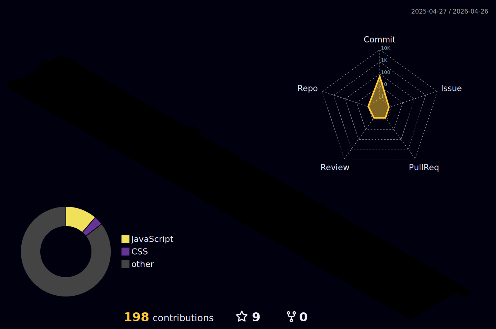

# Recent Activity

<!-- Summary -->

<!--START_SECTION:activity-->
1. 🗣 Commented on [#1](https://github.com/sllozier/emotion-flashcards-project/issues/1) in [sllozier/emotion-flashcards-project](https://github.com/sllozier/emotion-flashcards-project)
2. ❗️ Opened issue [#1](https://github.com/sllozier/emotion-flashcards-project/issues/1) in [sllozier/emotion-flashcards-project](https://github.com/sllozier/emotion-flashcards-project)
3. ❗️ Opened issue [#2](https://github.com/sllozier/bookshelf-app/issues/2) in [sllozier/bookshelf-app](https://github.com/sllozier/bookshelf-app)
4. ❗️ Opened issue [#2](https://github.com/sllozier/lozier-school-management/issues/2) in [sllozier/lozier-school-management](https://github.com/sllozier/lozier-school-management)
5. ❗️ Opened issue [#1](https://github.com/sllozier/lozier-school-management/issues/1) in [sllozier/lozier-school-management](https://github.com/sllozier/lozier-school-management)
<!--END_SECTION:activity-->
